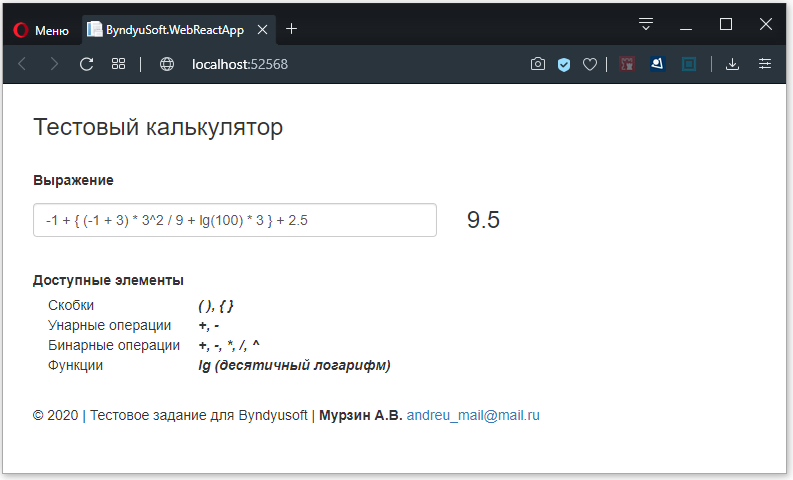

## © 2020 | Тестовое задание для Byndyusoft

*Исполнитель: Мурзин Андрей. andreu_mail@mail.ru, 8-904-3066006*

### Задание
> Необходимо написать на C# консольный калькулятор (можно с веб-интерфейсом), который принимает входную строку, содержащую математическое выражение (целые и десятично-дробные числа, знаки +, -, *, / и скобки) и выводит в консоль результат его вычисления. Задание предполагает самостоятельную реализацию парсинга и расчета математического выражения. 

> Главным критерием при оценке задания является использование при разработке TDD и принципов SOLID. Архитектура решения должна обеспечивать расширение списка поддерживаемых операций при минимальном и максимально безболезненном для существующей функциональности внесении изменений в исходный код. Код должен быть легко читаемым и отформатирован в едином стиле, содержать минимальное число поясняющих комментариев.  
>> *Пример консольного ввода*:  
Введите выражение: 1+2-3  
Результат: 0

> Результатом будет публично доступный репозиторий на Github и исходным кодом тестового задания.

### Сборка проекта
> Для сборки проекта необходимо наличие установленных Visual Studio с пакетом SDK для .NET Core 2.1 и Node.js ( https://nodejs.org ) с пакетным менеджером npm.  
Для запуска достаточно просто запустить проект из Visual Studio по F5 (react приложение автоматически сбилдится и запустится в ReactDevelopmentServer).

### Реализация
> Проект представляет собой Web SPA-приложение (React.js), backend часть — .NET Core WebAPI2.   
Приложение было полностью *разработано по технологии TDD* и *соответствует всем принципам SOILID*.  
*Используемые технологии*: **c#**, **.net core webapi2**, **js**, **react.js**, **mstest**, **html**, **css**

> Все модули полностью покрыты unit-тестами.  
Расширяемость функционала калькулятора продемонстрирована в модуле **ByndyuSoft.Testwork.UnitTests/DemoAbilities.cs** (добавление констант, скобок, операций и функций).

> 
